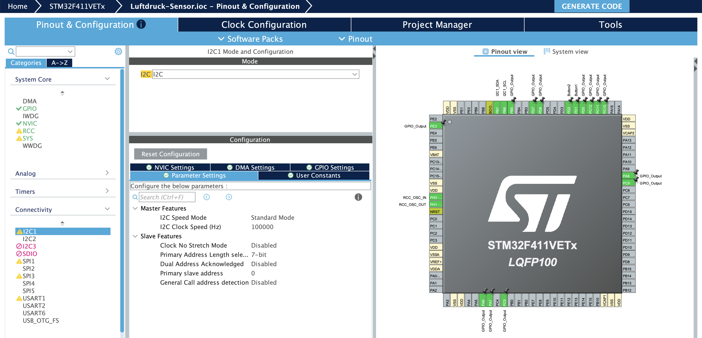
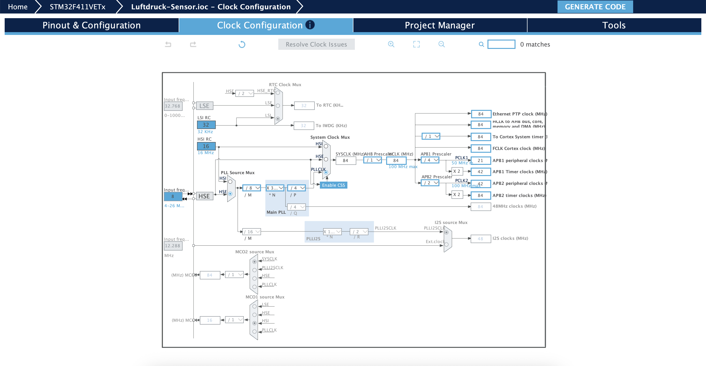
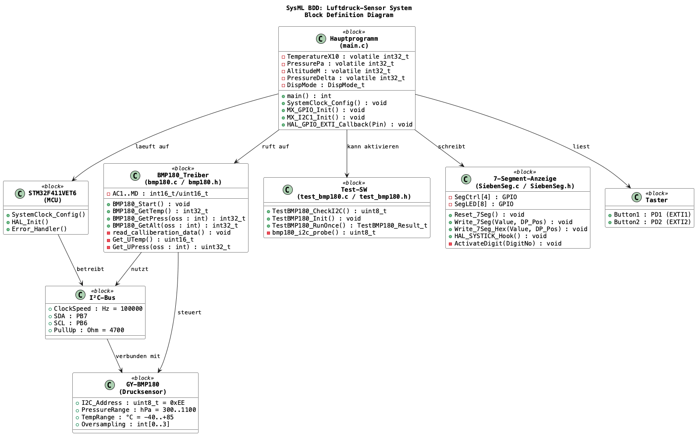
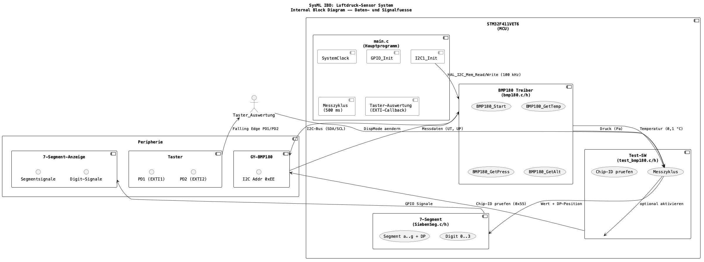

# Luftdruck-Sensor Projekt: GY-BMP180 mit STM32F4 Discovery Board

**LVA:** Angewandte Mikrocontrollerprogrammierung UE, SS26  
**Jahrgang:** AE27 (4. Semester)  
**Gruppe:** 3 -- Sensor für Luftdruck GY-BMP180  


## 1. Aufgabenstellung

**Ziel:** Messen Sie Änderungen des Luftdrucks und zeigen Sie diese an.

| Nr | Aufgabe | Status |
|----|---------|:------:|
| 1 | Analyse der Funktionen der jeweiligen Komponente (Datenblatt aus Web besorgen!) | [x] |
| 2 | Anschluss der jeweiligen Komponente an den STM32 über die Schnittstelle, die der jeweilige Sensor bereithält | [x] |
| 3 | Inbetriebnahme und (nachweisliche!) Lösung der gestellten Aufgabe | [x] |
| 4 | Geeignete Visualisierung der Ergebnisse unter Zuhilfenahme des E/A-Boards (7-Segmentanzeige, LED, usw.) oder eines 2004-LCD-Displays | [x] |
| 5 | Erstellung einer Test-SW auf dem STM32, wobei die Bedienung der jeweiligen Komponente in wiederverwendbare Funktionen ausgelagert sein muss | [x] |
| 6 | Dokumentation von Anschluss, Funktion, Parametern, Randbedingungen usw. sowie der SW | [x] |

## 2. Komponentenanalyse: BMP180 (Aufgabe 1)

### 2.1 Allgemeine Beschreibung

Der **BMP180** ist ein digitaler Barometer- und Temperatursensor der Firma Bosch Sensortec. Er wird auf dem Modul **GY-BMP180** als Breakout-Board betrieben. Der Sensor misst den absoluten Luftdruck und die Umgebungstemperatur und gibt die Rohdaten über eine **I²C-Schnittstelle** aus.

**Datenblatt:** [BST-BMP180-DS000-09](https://cdn-shop.adafruit.com/datasheets/BST-BMP180-DS000-09.pdf) (Adafruit / Bosch Sensortec)

### 2.2 Technische Kenndaten (laut Datenblatt)

| Parameter | Wert |
|-----------|------|
| Versorgungsspannung (VDD) | 1,8 V -- 3,6 V |
| I²C-Adresse (Write) | 0xEE (CSB = High) |
| I²C-Adresse (Read) | 0xEF |
| Druckbereich | 300 hPa -- 1100 hPa |
| Druckgenauigkeit (absolut) | +/-0,12 hPa (Hochauflösungsmodus) |
| Druckauflösung | 0,01 hPa (0,17 Pa) bei Oversampling = 3 |
| Temperaturbereich | --40 °C bis +85 °C |
| Temperaturauflösung | 0,1 °C |
| Stromaufnahme (Messung) | typ. 5 uA (Ultra-Low-Power) |
| Standby-Strom | typ. 0,1 uA |
| Wandlungszeit (Temperatur) | 4,5 ms |
| Wandlungszeit (Druck, oss=0) | 4,5 ms |
| Wandlungszeit (Druck, oss=3) | 25,5 ms |
| Schnittstelle | I²C (max. 3,4 MHz) |

### 2.3 Funktionsprinzip

Der BMP180 basiert auf einem **piezoresistiven Druckmesszellen-Element**. Eine dünne Siliziummembran verformt sich unter Druckeinwirkung; die resultierende Widerstandsänderung wird in ein elektrisches Spannungssignal umgesetzt. Über einen internen A/D-Wandler (ADC) werden die Rohspannungen digitalisiert.

Da die Kennlinie des Drucksensors temperaturabhängig und von Exemplar zu Exemplar leicht unterschiedlich ist, sind im Sensorwerk **individuelle Kalibrierkoeffizienten** in einem EEPROM abgelegt (Adressbereich 0xAA--0xBF, 22 Byte = 11 x 16 Bit). Ohne diese Koeffizienten kann aus den Rohwerten keine korrekte physikalische Größe berechnet werden.

Die Kalibrierkoeffizienten umfassen:

| Koeffizient | Typ | Verwendung |
|-------------|-----|------------|
| AC1, AC2, AC3 | signed 16 Bit | Temperatur- und Druckkompensation (lineare Terme) |
| AC4 | unsigned 16 Bit | Skalierungsfaktor für Druckberechnung |
| AC5, AC6 | unsigned 16 Bit | Temperaturberechnung (Multiplikatoren/Offsets) |
| B1, B2 | signed 16 Bit | Nichtlineare Druckkorrektur |
| MB, MC, MD | signed 16 Bit | Temperaturkorrekturkonstanten |


## 3. Anschluss an den STM32 (Aufgabe 2)

### 3.1 I²C-Schnittstelle

Der BMP180 kommuniziert ausschließlich über den **I²C-Bus**. Die Übertragungsrate wird auf **100 kHz (Standard-Modus)** konfiguriert, was für die Abtastrate von 2 Hz völlig ausreichend ist.

Die I²C-Adresse des Moduls beträgt **0xEE** (Write) bzw. **0xEF** (Read) bei unbeschaltetem CSB-Pin (CSB = High).

### 3.2 Verkabelung

Laut Datenblatt sind externe **4,7 kOhm-Pull-up-Widerstände** auf SDA und SCL erforderlich, da die STM32F4-Discovery-Board-internen Pull-ups zu schwach für die Buskapazität sind.

```
BMP180 (GY-BMP180)           STM32F4-DISCOVERY (STM32F411VET6)
---------------------------------------------------------------
GND  ----------------------> GND
VCC  ----------------------> 3,3 V (VDD)

SDA  ---+------------------> PB7 (I2C1_SDA)
        |
     [ 4,7 kOhm ]
        |
        --------------------> 3,3 V (VDD)

SCL  ---+------------------> PB6 (I2C1_SCL)
        |
     [ 4,7 kOhm ]
        |
        --------------------> 3,3 V (VDD)
```

### 3.3 Pin-Konfiguration (CubeMX)

| MCU-Pin | Funktion | Verbunden mit |
|---------|----------|--------------|
| PB6 | I2C1_SCL (AF4) | BMP180 SCL |
| PB7 | I2C1_SDA (AF4) | BMP180 SDA |
| PA6 | GPIO_OUT | 7-Segment Digit 1 |
| PA7 | GPIO_OUT | 7-Segment Digit 0 |
| PA8 | GPIO_OUT | 7-Segment Segment c |
| PC5 | GPIO_OUT | 7-Segment Digit 2 |
| PC9 | GPIO_OUT | 7-Segment DP |
| PC10 | GPIO_OUT | 7-Segment Segment e |
| PC11 | GPIO_OUT | 7-Segment Segment d |
| PC12 | GPIO_OUT | 7-Segment Segment a |
| PD0 | GPIO_OUT | 7-Segment Segment b |
| PD1 | EXTI1 (Eingang) | Button 1 (Modusumschaltung) |
| PD2 | EXTI2 (Eingang) | Button 2 (Modusumschaltung) |
| PD6 | GPIO_OUT | 7-Segment Segment f |
| PD7 | GPIO_OUT | 7-Segment Segment g |
| PE3 | GPIO_OUT | 7-Segment Digit 3 |



*Abbildung 1: Screenshot der CubeMX Konfiguration, Pinout*




*Abbildung 2: Screenshot der CubeMX Konfiguration, Clock*


### 3.4 I²C-Konfiguration im Detail

```c
hi2c1.Instance = I2C1;
hi2c1.Init.ClockSpeed = 100000;          // 100 kHz Standard-Modus
hi2c1.Init.DutyCycle = I2C_DUTYCYCLE_2;  // Tastverhältnis (bei Fast-Mode relevant)
hi2c1.Init.OwnAddress1 = 0;              // Eigene Adresse (nicht verwendet)
hi2c1.Init.AddressingMode = I2C_ADDRESSINGMODE_7BIT;
hi2c1.Init.DualAddressMode = I2C_DUALADDRESS_DISABLE;
hi2c1.Init.GeneralCallMode = I2C_GENERALCALL_DISABLE;
hi2c1.Init.NoStretchMode = I2C_NOSTRETCH_DISABLE;
```

### 3.5 Taktversorgung

Im Auslieferungszustand läuft der STM32F411VET6 nach Reset mit dem internen **HSI-Oszillator** bei **16 MHz**; die **PLL** und der externe **HSE-Quarz** sind dabei zunächst noch nicht aktiv.

Für dieses Projekt wird der Controller aber bewusst mit einem **8 MHz HSE-Quarz** betrieben, weil damit eine präzise und stabile Zeitbasis zur Verfügung steht, die genug Rechenreserve für Sensorwert-Berechnung und Anzeige bietet. Die zulässigen Taktbereiche ergeben sich aus dem **STM32F411-Datenblatt** und dem **Reference Manual**; die konkrete Einstellung stammt aus der **CubeMX-Konfiguration**. 

Gleichzeitig ergeben sich saubere Taktverhältnisse für die Peripherie, insbesondere für den I²C-Bus und das SysTick-Intervall. HSE steht für **High Speed External** und bezeichnet den externen Haupttaktgeber. Über die **PLL** (Phase-Locked Loop) wird dieser präzise Eingangstakt vervielfacht und die Systemtaktfrequenz auf **84 MHz** hochgesetzt:

```
HSE 8 MHz -> PLL (M=8, N=336, P=4) -> SYSCLK 84 MHz
                                     -> AHB 84 MHz
                                     -> APB1 21 MHz (I²C1)
                                     -> APB2 42 MHz
```

## 4. Inbetriebnahme und Messergebnisse (Aufgabe 3)

### 4.1 Initialisierungsablauf

1. **Systemstart:** HAL_Init(), SystemClock_Config()
2. **GPIO-Initialisierung:** MX_GPIO_Init() -- alle 7-Segment-Pins + Taster
3. **I²C-Initialisierung:** MX_I2C1_Init() -- I²C1 auf 100 kHz
4. **Sensor-Init:** BMP180_Start()
   - Liest 22 Byte Kalibrierdaten aus EEPROM ab Adresse 0xAA
   - Speichert 11 Koeffizienten in globalen Variablen
5. **Hauptschleife:** Die Hauptschleife läuft **ohne blockierende Warteschleifen** (`HAL_Delay`). Stattdessen wird über `HAL_GetTick()` die Systemzeit abgefragt und Tasks nur ausgeführt, wenn ihr Intervall abgelaufen ist

### 4.3 Nachweis der Funktion

Das System wurde erfolgreich in Betrieb genommen. Die gemessenen Werte liegen im erwarteten Bereich:

| Größe | Typischer Wert | Bereich |
|-------|---------------|---------|
| Luftdruck | ~994 hPa (Wien, ~171 m ü.NN.) | 980-1020 hPa |
| Temperatur | ~22-26 °C (Raumtemperatur) | abhängig von Umgebung |
| Höhe | ~0-266 m (rel. zum Referenzdruck) | +/-500 m (Näherung) |

Durch vorsichtiges Drücken auf die Sensormembran oder Erwärmen des Sensors mit der Hand können Druck- bzw. Temperaturänderungen sichtbar gemacht werden.


*Abbildung 3: Finaler Aufbau mit BMP180 und STM32F4 Discovery Board*


## 5. Visualisierung (Aufgabe 4)

### 5.1 7-Segment-Anzeige (FH-Übungsboard)

Die Visualisierung erfolgt über die **4-stellige 7-Segment-Anzeige** auf dem FH-Übungsboard. Die Ansteuerung erfolgt mit der Bibliothek `SiebenSeg.h`/`SiebenSeg.c` von FH-Prof. Herbert Paulis.

**Ansteuerungsprinzip:** Multiplexing über SysTick-1ms-Interrupt (`HAL_SYSTICK_Hook()`).

**GPIO-Belegung der 7-Segment-Anzeige:**

| Funktion | GPIO | Belegung |
|----------|------|----------|
| Digit 0 (links) | PA7 | Ziffernauswahl |
| Digit 1 | PA6 | Ziffernauswahl |
| Digit 2 | PC5 | Ziffernauswahl |
| Digit 3 (rechts) | PE3 | Ziffernauswahl |
| Segment a | PC12 | Anzeige |
| Segment b | PD0 | Anzeige |
| Segment c | PA8 | Anzeige |
| Segment d | PC11 | Anzeige |
| Segment e | PC10 | Anzeige |
| Segment f | PD6 | Anzeige |
| Segment g | PD7 | Anzeige |
| Dezimalpunkt | PC9 | Anzeige |

### 5.2 Anzeigemodi

Die Anzeige wird über zwei Taster gesteuert:

**Button 1 (PD1):** Wechselt zwischen Luftdruck (DISP_PRESSURE) und Druckänderung (DISP_DELTA).

**Button 2 (PD2):** Schaltet zyklisch durch: Temperatur -> Höhe -> Druck -> Temperatur -> ...

| Modus | Anzeige | Beispiel | Format |
|-------|---------|----------|--------|
| DISP_PRESSURE | Druck in bar | `0.994` | 4 Ziffern, DP links |
| DISP_DELTA | Druckänderung in Pa | `0050` = 50 Pa | 4 Ziffern, kein DP |
| DISP_TEMPERATURE | Temperatur in °C | `08.30` = 8,30 °C | 4 Ziffern, DP an Pos. 1 |
| DISP_ALTITUDE | Höhe in Metern | `0266` = 266 m | 4 Ziffern, kein DP |

**Skalierung für die Anzeige (Integer-Arithmetik):**

- **Druck (Pa -> bar x 1000):** `PressureBarX1000 = (PressurePa + 50) / 100`  
  *(z. B. 99400 Pa -> 994 -> Anzeige `0.994` bar)*

- **Temperatur (0,1 °C -> 0,01 °C):** `TempX100 = TemperatureX10 * 10`  
  *(z. B. 253 -> 2530 -> Anzeige `25.30` °C)*

- **Druckänderung (Pa):** Absolutwert, direkt angezeigt

- **Höhe (m):** Ganzzahlig, direkt angezeigt

Bei negativen Temperaturen wird keine Zahl angezeigt, da die 7-Segment-Anzeige keine negativen Vorzeichen darstellen kann.

### 5.3 Entprellung der Taster

Beide Taster werden über **EXTI-Interrupts** (External Interrupt) erkannt und softwareseitig mit einer **Entprellzeit** `DEBOUNCE_MS` entprellt:

```c
void HAL_GPIO_EXTI_Callback(uint16_t GPIO_Pin)
{
    static uint32_t lastTick1 = 0, lastTick2 = 0;
    uint32_t now = HAL_GetTick();  /* Systemzeit aus SysTick-Interrupt */

    if (GPIO_Pin == Button1_Pin) {
        if ((now - lastTick1) > DEBOUNCE_MS) {
            lastTick1 = now;
            DispMode = (DispMode == DISP_DELTA) ? DISP_PRESSURE : DISP_DELTA;
        }
    }
    else if (GPIO_Pin == Button2_Pin) {
        if ((now - lastTick2) > DEBOUNCE_MS) {
            lastTick2 = now;
            /* zyklisch: TEMP -> ALT -> PRESS -> TEMP -> ... */
        }
    }
}
```

## 6. Test-Software (Aufgabe 5)

### 6.1 Architektur

Die Test-SW wurde als **wiederverwendbare, modulare Bibliothek** implementiert, bestehend aus:

- **`Core/Inc/test_bmp180.h`** -- öffentliche Schnittstelle (Deklarationen + Datenstrukturen)
- **`Core/Src/test_bmp180.c`** -- Implementierung aller Testfunktionen

Die Testlogik ist vollständig von der Hauptapplikation entkoppelt. Sie kann über das Compile-Flag `BMP180_TEST` aktiviert werden.

### 6.2 Öffentliche API

```c
typedef struct {
    int32_t temperature_x10;  // Temperatur in 0,1 °C
    int32_t pressure_pa;      // Luftdruck in Pascal
    int32_t altitude_m;       // Berechnete Höhe in Metern
    int32_t pressure_delta;   // Druckänderung seit letztem Sample
    uint8_t i2c_ok;           // != 0 wenn BMP180 auf I²C antwortet
    uint8_t ok;               // != 0 wenn Messung erfolgreich
} TestBMP180_Result_t;

uint8_t TestBMP180_CheckI2C(void);
void    TestBMP180_Init(void);
TestBMP180_Result_t TestBMP180_RunOnce(void);
```

### 6.3 Testablauf

1. **`TestBMP180_CheckI2C()`** -- Liest das Chip-ID-Register (0xD0) und prüft auf Wert 0x55. Damit wird die korrekte Verdrahtung und Erreichbarkeit des Sensors bestätigt.

2. **`TestBMP180_Init()`** -- Ruft `BMP180_Start()` auf (lädt Kalibrierdaten) und führt eine erste Druckmessung als Referenz durch.

3. **`TestBMP180_RunOnce()`** -- Führt einen vollständigen Messzyklus durch:
   - I²C-Prüfung (Chip-ID)
   - Temperaturmessung (BMP180_GetTemp)
   - Druckmessung (BMP180_GetPress)
   - Höhenberechnung (BMP180_GetAlt)
   - Differenzbildung (aktuell - letzter Wert)
   - Rückgabe aller Werte in einer Struktur


### 6.4 Test-Modus aktivieren

Der Test-Modus wird über das CMake-Flag `BMP180_TEST` aktiviert. Am einfachsten ueber den VS Code Task **"Build and Flash Test"**.

Manuell:
```bash
cmake -B build/Bmp180Test -DBMP180_TEST=ON
cmake --build build/Bmp180Test
```

Das erzeugt ein Binary, das nach dem Flashen **sofort die Test-Ergebnisse auf der 7-Segment-Anzeige** zeigt.

### 6.5 Test-Ergebnisse anzeigen

Der Test-Modus zeigt die Ergebnisse **direkt auf der 7-Segment-Anzeige** -- kein Debugger nötig.

**Ablauf:**
1. VS Code Task **"Build and Flash Test"** ausführen
2. 7-Segment-Anzeige beobachten:

| Anzeige | Bedeutung |
|---------|-----------|
| `E1` | I²C-Fehler: Sensor nicht erreichbar (Verdrahtung prüfen) |
| `E2` | Lesefehler: Sensor antwortet, aber Messwert ist 0 (defekter Sensor) |
| `22.3` | Temperatur: 22,3 Grad C (2 Sekunden) |
| `0.994` | Druck: 0,994 bar = 994 hPa (2 Sekunden) |
| `0276` | Höhe: 276 m (2 Sekunden) |

Die Werte wechseln alle 2 Sekunden automatisch durch.

**Laufzeit-I²C-Überwachung:** Der Test prüft vor jedem Anzeigewert erneut die I²C-Verbindung. Wenn während des Tests ein Kabel abgesteckt wird, wechselt die Anzeige sofort zu `E1`. Wird das Kabel wieder angesteckt, liest der Test die Sensorwerte neu ein und zeigt wieder Temp/Druck/Höhe an. Das demonstriert die Fähigkeit des Systems, Hardware-Fehler zur Laufzeit zu erkennen und sich davon zu erholen.

**E2 testen:** E2 ist ein theoretischer Fehlerfall (Sensor antwortet auf I²C, liefert aber Druck = 0). In der Praxis tritt er kaum auf. Zum Testen kann in `test_bmp180.c` Zeile 59 temporaer `r.ok = 0;` gesetzt werden.

**Fehlersuche:**
- `E1` → I²C-Verbindung prüfen (SDA/SCL, Pull-ups, 3,3 V)
- `E2` → Sensor defekt oder I²C-Kommunikation gestört

### 6.6 Test der wiederverwendbaren BMP180-Bibliothek

Die Sensor-Bibliothek in `Core/Inc/bmp180.h` und `Core/Src/bmp180.c` stellt folgende öffentliche Funktionen bereit:

```c
void    BMP180_Start(void);                    // Initialisierung + Kalibrierung
int32_t BMP180_GetTemp(void);                  // Temperatur in 0,1 °C
int32_t BMP180_GetPress(int oss);              // Druck in Pascal (oss = 0..3)
int32_t BMP180_GetAlt(int oss);                // Höhe in Metern (Näherung)
```

Diese Funktionen sind vollständig **wiederverwendbar** und können in jedes STM32-Projekt übernommen werden, das einen BMP180 an I²C1 angeschlossen hat.


## 7. Software-Dokumentation (Aufgabe 6)


### 7.1 Systemarchitektur

```

+------------------------------- main.c ---------------------------------+
|  +----------------+  +-------------------+  +---------------------+    |
|  | SystemInit     |  | BMP180 API        |  | 7-Seg Display       |    |
|  | Clock Config   |  |                   |  | (SiebenSeg.c)       |    |
|  | GPIO Init      |  | BMP180_Start      |  |                     |    |
|  | I2C Init       |  | BMP180_GetTemp    |  | Reset_7Seg()        |    |
|  |                |  | BMP180_GetPress   |  | Write_7Seg()        |    |
|  |                |  | BMP180_GetAlt     |  | Write_7Seg_Hex()    |    |
|  +----------------+  +---------+---------+  +---------------------+    |
|                               |                                        |
|                        +------+------+                                 |
|                        | test_bmp180 |                                 |
|                        | (optional)  |                                 |
|                        +-------------+                                 |
+------------------------------------------------------------------------+
                                | I2C
                        +-------+--------+
                        | BMP180 Sensor  |
                        +----------------+
```

Interrupts (asynchron zur Hauptschleife):
```
  SysTick (1 ms) --> HAL_IncTick() + HAL_SYSTICK_Hook() (Multiplexing)
  EXTI1 (PD1)    --> Button 1: DISP_PRESSURE <-> DISP_DELTA
  EXTI2 (PD2)    --> Button 2: TEMP -> ALT -> PRESS -> ...
```
Schleife im Main Code: 
```
while (1)                                                
  {                                                          
    if (Zeit >= SENSOR_INTERVAL_MS) --> BMP180_GetTemp/Press/Alt (Sensor Messung) 
    if (Zeit >= DISPLAY_INTERVAL_MS)   --> Write_7Seg(DispMode)  (Display Update)      
  }   
```

### 7.2 Verwendete HAL-Ressourcen

| HAL-Funktion | Zweck |
|-------------|-------|
| `HAL_I2C_Mem_Read()` | Liest per I²C aus einem Sensorregister |
| `HAL_I2C_Mem_Write()` | Schreibt per I²C in ein Sensorregister |
| `HAL_GPIO_WritePin()` | Setzt einen GPIO-Pin auf High/Low |
| `HAL_GPIO_EXTI_IRQHandler()` | Bearbeitet externe Interrupts (Taster) |
| `HAL_Delay()` | Blockierende Verzögerung in ms |
| `HAL_GetTick()` | Systemzeit (ms) seit Start  |
| `HAL_IncTick()` | Wird im SysTick-Interrupt erhöht |

### 7.3 Wichtige Parameter und Randbedingungen

| Parameter | Wert | Begründung |
|-----------|------|------------|
| I²C-Takt | 100 kHz | Ausreichend für 2-Hz-Abtastrate, niedriger Stromverbrauch |
| Oversampling (oss) | 0 | Minimale Wandlungszeit (4,5 ms), bei 500 ms Abtastintervall ausreichend |
| Sensor-Abtastintervall | 500 ms | BMP180 benötigt ~10 ms pro Messzyklus (Temp + Druck) |
| Display-Update-Intervall | 10 ms (100 Hz) | Flackerfreie Anzeige, schnelle Reaktion auf Taster-Druck |
| I²C-Pull-up | 4,7 kOhm | Datenblatt-Empfehlung, notwendig für zuverlässige Kommunikation |
| Kalibrierdaten | 22 Byte / 11 Koeffizienten | Werden beim Start einmalig ausgelesen |
| Höhen-Näherung | linear: dh = (p0-p)*8434/p0 | Ausreichend für kleine Höhenunterschiede (< 500 m) |
| SysTick | 1 ms | Grundlage für HAL_GetTick() und 7-Segment-Multiplexing |
| Taster-Entprellung | 200 ms (im EXTI-Callback) | Verhindert mehrfaches Auslösen durch Prellen |
| Interrupt-Prioritäten | SysTick=0, EXTI1=0, EXTI2=0 | Gleiche Priorität, SysTick hat Vorrang als System-Timer |

### 7.4 Kompensationsalgorithmus (nach Datenblatt)

#### Temperatur

```
UT = Rohwert aus Register 0xF6 (16 Bit)
X1 = (UT - AC6) * AC5 / 2^15
X2 = MC * 2^11 / (X1 + MD)
B5 = X1 + X2
T  = (B5 + 8) / 2^4         -> Temperatur in 0,1 Grad C
```

#### Druck

```
UP = Rohwert aus Registern 0xF6-0xF8 (19..24 Bit, je nach oss)
B6 = B5 - 4000
X1 = (B2 * (B6^2 / 2^12)) / 2^11
X2 = (AC2 * B6) / 2^11
X3 = X1 + X2
B3 = ((AC1 * 4 + X3) * 2^oss + 2) / 4
X1 = (AC3 * B6) / 2^13
X2 = (B1 * (B6^2 / 2^12)) / 2^16
X3 = ((X1 + X2) + 2) / 4
B4 = AC4 * (X3 + 32768) / 2^15
B7 = (UP - B3) * 50000 / 2^oss
p  = (B7 < 0x80000000) ? (B7 * 2 / B4) : (B7 / B4 * 2)
X1 = ((p / 2^8)^2) * 3038 / 2^16
X2 = -7357 * p / 2^16
p  = p + (X1 + X2 + 3791) / 2^4   -> Druck in Pa
```

Alle Berechnungen erfolgen in **vorzeichenbehafteter Integer-Arithmetik** (32 Bit), um FPU-Latenzen zu vermeiden und die Portabilität auf Cortex-M0/M3 zu erhalten.


*Abbildung 4: Kompensationsalgorithmus für Druck und Temperatur (Datenblatt S. 15)*

### 7.5 Höhenberechnung

Die barometrische Höhenformel

```
h = 44330 * (1 - (p/p0)^(1/5.255))
```

wurde aus Performance-Gründen durch eine **lineare Näherung** ersetzt:

```
dh = (p0 - p) * 8434 / p0
```

Diese Näherung ist für kleine Höhenunterschiede (dh < 500 m) ausreichend genau und benötigt keine Gleitkomma- oder Potenzfunktionen.

### 7.6 Kalibrierung des Meeresspiegeldrucks

Optional kann eine bekannte Referenzhöhe (`KnownAltitudeMeters` in main.c) angegeben werden. Beim ersten Messzyklus wird daraus der äquivalente Meeresspiegeldruck rückgerechnet:

```c
p0 = p * (1 - h0/44330)^(-5.255)
```

Ist `KnownAltitudeMeters = 0`, wird der erste gemessene Druck als lokaler Referenzdruck verwendet (Relativmodus).

## 8. Interpretation der Ergebnisse

Eine Luftdruckänderung ist im Alltag meist nur eine kleine, langsame Verschiebung des Messwerts:

| Änderung | Interpretation |
|----------|---------------|
| Druck sinkt über Stunden/Tage | Mögliches Tiefdruckgebiet -> instabileres Wetter |
| Druck steigt langsam | Hochdruckgebiet -> stabiles Wetter |
| Druckänderung > 100 Pa/h | Deutliche Wetteränderung wahrscheinlich |
| Temperaturänderung durch Handwärme | Gut sichtbar auf der Anzeige |

Das Projekt bildet diese Änderungen durch `PressureDelta` (in Pascal) ab. Die 7-Segment-Anzeige zeigt wahlweise den Absolutdruck, die Temperatur, die Höhe oder die momentane Druckänderung.


## 9. Quellen

- **Datenblatt BMP180:** Bosch Sensortec, BST-BMP180-DS000-09  
  https://cdn-shop.adafruit.com/datasheets/BST-BMP180-DS000-09.pdf
- **STM32F4 HAL Manual:** STMicroelectronics, UM1725  
  (beiliegend: `docs/HAL_manual_F4_Mar_2023.pdf`)
- **controllerstech -- BMP180 + STM32 Tutorial:**  
  https://controllerstech.com/interface-bmp180-with-stm32/
- **Barometrische Höhenformel:** Wikipedia  
  https://de.wikipedia.org/wiki/Barometrische_H%C3%B6henformel
- **Luftdruck:** Wikipedia  
  https://de.wikipedia.org/wiki/Luftdruck
- **SiebenSeg-Bibliothek:** FH-Prof. Herbert Paulis, FH Campus Wien


## 10. SysML-Modell

Das System wurde in der **Systems Modeling Language (SysML)** modelliert. Die Modelle befinden sich im Verzeichnis `docs/sysml/` und können mit **PlantUML** gerendert werden:

```bash
plantuml docs/sysml/bmp180_sysml.puml     # Block Definition Diagram
plantuml docs/sysml/bmp180_ibd.puml       # Internal Block Diagram
```

### 10.1 Block Definition Diagram (BDD)

Das BDD zeigt die Systemarchitektur auf Blockebene:



*Abbildung 5: SysML Block Definition Diagram -- Systemarchitektur*

### 10.2 Internal Block Diagram (IBD)

Das IBD zeigt die Daten- und Signalfüsse zwischen den Komponenten:



*Abbildung 6: SysML Internal Block Diagram -- Daten- und Signalfüsse*


## 11. Projektstruktur (STM32CubeIDE)

```
Luftdruck-Sensor/
+-- Core/
|   +-- Inc/
|   |   +-- bmp180.h          # BMP180-Treiber (öffentliche API)
|   |   +-- main.h            # Hauptdatei (Pin-Defines)
|   |   +-- SiebenSeg.h       # 7-Segment-Bibliothek
|   |   +-- test_bmp180.h     # Test-SW (öffentliche API)
|   |   +-- stm32f4xx_hal_conf.h
|   |   +-- stm32f4xx_it.h
|   +-- Src/
|       +-- main.c            # Hauptprogramm
|       +-- bmp180.c          # BMP180-Treiber (Implementierung)
|       +-- SiebenSeg.c       # 7-Segment-Bibliothek
|       +-- test_bmp180.c     # Test-SW (Implementierung)
|       +-- stm32f4xx_it.c    # Interrupt-Handler
|       +-- stm32f4xx_hal_msp.c
|       +-- syscalls.c / sysmem.c
|       +-- system_stm32f4xx.c
+-- Drivers/                  # HAL- und CMSIS-Treiber
+-- docs/
|   +-- datasheet/            # BMP180-Datenblatt (PDF)
|   +-- images/               # Abbildungen für Doku
|   +-- HAL_manual_F4_Mar_2023.pdf
|   +-- luftdruck-sensor-projekt.pdf
+-- Luftdruck-Sensor.ioc      # STM32CubeMX-Projektdatei
+-- CMakeLists.txt            # CMake-Build-Konfiguration
+-- Doxyfile                  # Doxygen-Konfiguration
+-- readme.md                 # Diese Datei
```
