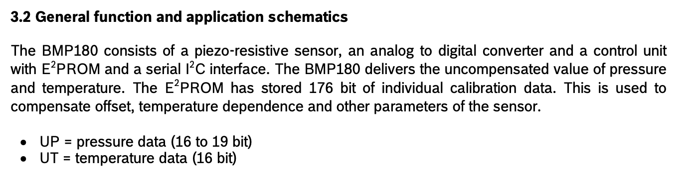
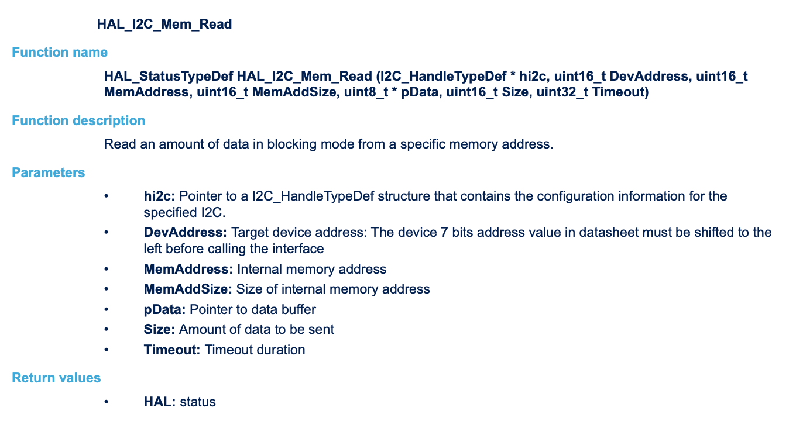
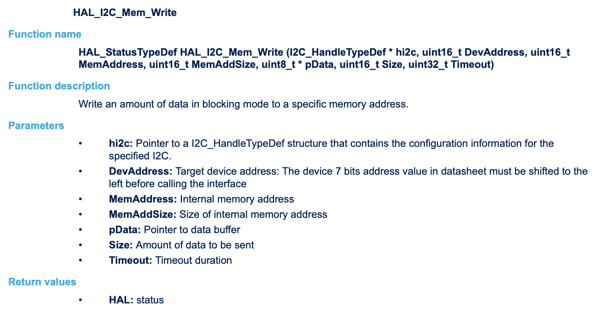
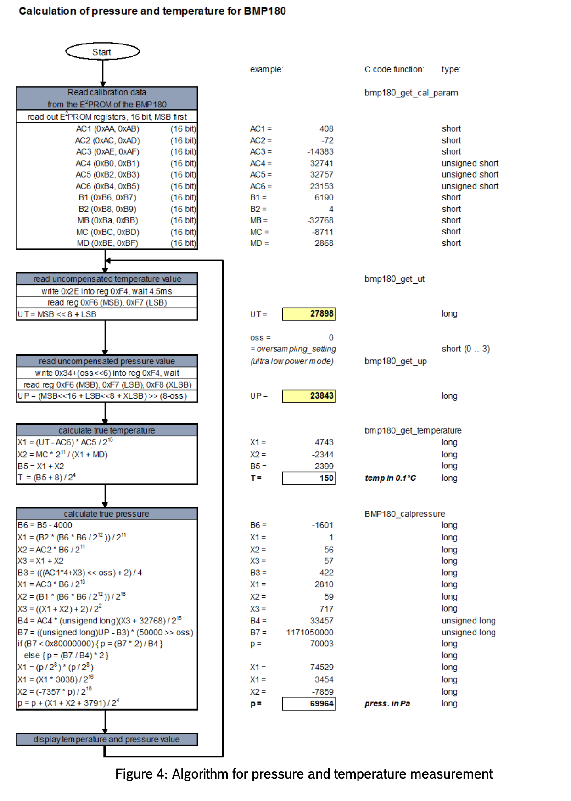
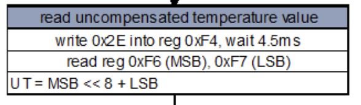
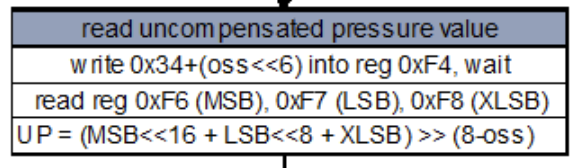

# Luftdruck Sensor Projekt mit STM32F4 Discovery Board
Projekt für LVA `Angewandte Mikrocontrollerprogrammierung`, SS26 Jahrgang AE27

## Aufgabenstellung
Messen Sie Änderungen des Luftdrucks und zeigen Sie diese an.

| Nr | Aufgabe | Erledigt |
|----|-----------------------------------------------------------------------------------------------------------------------------------|:---:|
| 1  | Analyse der Funktionen der jeweiligen Komponente (Datenblatt aus Web besorgen!) | [ x ] |
| 2  | Anschluss der jeweiligen Komponente an den STM32 über die Schnittstelle, die der jeweilige Sensor bereithält. | [ x ] |
| 3  | Inbetriebnahme und (nachweisliche!) Lösung der gestellten Aufgabe. | [ x ] |
| 4  | Geeignete Visualisierung der Ergebnisse unter Zuhilfenahme des E/A-Boards (7-Segmentanzeige, LED, usw.) oder eines 2004-LCD-Displays. | [ x ] |
| 5  | Erstellung einer Test-SW auf dem STM32, wobei die Bedienung der jeweiligen Komponente in wiederverwendbare Funktionen ausgelagert sein muss. | [ ] |
| 6  | Dokumentation von Anschluss, Funktion, Parametern, Randbedingungen usw. sowie der SW. | [ x ] |

## Sensordaten: BMP180
Der Sensor GY-BMP180 ist in der Lage, Temperatur, Luftdruck und Luftfeuchte
zu messen

Siehe Datenblatt: https://cdn-shop.adafruit.com/datasheets/BST-BMP180-DS000-09.pdf



### [ Extra ] Höheneinstellung BMP180

Der BMP180-Sensor misst Luftdruck und berechnet daraus die Höhe. 

**Für Wien (171m über NN):**

```cpp
const float reference_altitude = 171.0; // Meter - anpassen je nach deinem genauen Standort
```

Die Höhe wird im Code berechnet, nicht am Sensor selbst eingestellt. Nutze deine Garmin-Höhe als Referenzwert für die genaueste Kalibrierung.

Der Sensor kann Höhenänderungen mit einer Genauigkeit von ±0,25m messen (Ultra-High-Resolution-Modus).


## I2C Kommunikation
Die I2C Addresse des BMP180 ist `0xEE` laut dem Datenblatt

### Verkabelung
Mit zusätzlichen 4,7kOhm Pull-up Widerständen bei SDA und SCL wird wie folgt verkabelt:

```

BMP180              STM32F4-DISCOVERY
--------------------------------------
GND ---------------> GND
VCC ---------------> VDD

SDA ---+-----------> PB7
       |
    [ 4.7k ]
       |
       ------------> VDD

SCL ---+-----------> PB6
       |
    [ 4.7k ]
       |
       ------------> VDD
       
```


## Cube MX Konfiguration
Project generiert in CubeMX 

## Verwendete HAL Funktionen

`HAL_I2C_Mem_Read()` - Liest per I2C Daten aus dem Sensorregister.




`HAL_I2C_Mem_Write()` - Schreibt per I2C Daten in eine gewünschte Speicheradresse.



## Bibliotheksfunktionen

Folgende Funktionen wurden in bmp180.h erstellt:

```

BMP180_Start
BMP180_GetTemp
BMP180_GetPress
BMP180_GetAlt

```

Auf Seite 15 vom Datenblatt ist der Algorithmus für Druck und Temperatur Messung dargestellt:



## 1. Kallibrierungswerte einlesen aus dem EEPROM vom BMP180
Der Sensor hat einen intern beschriebenen Speicher, in dem er 11 individuelle Kallibrierungs-Koeffizienten mit jeweils 16 bit hinterlegt. Diese sind zwingend erforderlich, um die ausgelesenen Rohdaten in korrekte Temperatur- und Luftdruckwerte umzuwandeln.

Der BMP180 physikalische Änderungen mittels piezoelektrischem Effekt und liefert unkompensierte Rohwerte. Produktionsbedingt können diese leicht unterschiedliche Eigenschaften je Sensor haben.

Der Mikrokontroller muss daher bei jedem Starat zunächst die im internen EEPROM gespeicherten 176 Bit (11 Kalibrierwerte, jeweils 16 Bit) auslesen, um die Formeln für Druck und Temperatur korrekt anwenden zu könen.

Die Werte heißen laut Datenblatt `AC1 bis AC6 und B1, B2, MB, MC, MD`, diese Werden als Kallibrierungsdaten einem Array `Callib_Data` initialisiert mit 0 und Start bei der BMP180 Speicher Adresse `0xAA` auf dem Mikrokontroller zwischengespeichert.

Mithilfe der HAL Funktion, um i2c memory zu lesen und zu schreiben werden die Kallibrierungswerte aus dem Sensorregister gelesen und in eine gewünschte Speicheradresse geschrieben.

### `HAL_I2C_Mem_Read(BMP180_I2C, BMP180_ADDRESS, Callib_Start, 1, Callib_Data,22, HAL_MAX_DELAY);`

- Parameter:
    - `BMP180_I2C`: das I2C-Interface, meistens hi2c1
    - `BMP180_ADDRESS`: Sensoradresse, hier 0XEE
    - `Callib_Start`: Startregister 0xAA
    - `1`: Registeradresse ist 1 Byte breit
    - `Callib_Data`: Zielpuffer für die gelesenen Daten
    - `22`: Anzahl der zu lesenden Bytes
    - `HAL_MAX_DELAY`: warten, bis der Vorgang fertig ist

Aus je 2 Byte im Array wird ein 16-Bit-Kallibrierungswert gebaut
`AC1 = ((Callib_Data[0] << 8) | Callib_Data[1]);`
Das High-Byte wird dabei um 8 Bit nach links verschoben und mit |  mit dem Low-Byte verknüpft. 
    -> Beide Bytes (Index 0 und Index 1) ergeben also einen 16 Bit Wert.
    -> AC1 ist ein kalibrierter Sensorparameter.

Nach diesem Prinzip werden alle 11 Kalibrierungsparameter erstellt:

- `AC1, AC2, AC3 (signed short)`: Temperatur-/Druck-Kalibrierungskoeffizienten, in linearen Termen der Druckkompensation auftreten
- `AC4 (unsigned short)`: Faktor in Divisionsschritten (dient zur Skalierung / Division) 
- `AC5, AC6 (unsigned short)`: weitere Kalibrierungskoeffizienten, werden bei Temperaturberechnung als Multiplikatoren/Offsets verwendet (z. B. AC5 dient zur Skalierung von UT)
- `B1, B2 (signed short)`: weitere Druck‑Korrekturkoeffizienten (nichtlinearer Teil)
- `MB, MC, MD (signed short)`: Temperaturkorrekturkonstanten, erscheinen in der Berechnung von X2 und B5

**Wichtig:**
Der BMP180  speichert einige Kalibrierwerte als vorzeichenbehaftet (unsigned short) andere nicht (short).

Physikalisch sind das keine direkten Messgrößen, sondern Parameter eines Herstellermodels, das die nichtlinearen Eigenschaften des individuellen Sensorelements korrigiert.

## 2. Temperatur: Von Rohdaten zu echten Messwerten 


### `GetUTemp()`
- schreibt Steuerbyte 0x2E ins Register 0xF4 -> startet Temperaturmessung
- wartet ~5ms (Messzeit)
- Liest 2 Bytes aus 0xF6 aus und liefert damit den ungefähren Rohwert UT (uint 16).

Um aus dem unkompensierten Temperaturwert wird mit der Funktion `BMP180_GetTemp()` der "echte" Messwert berechnet:
$$
X_1 = \frac{(UT - AC6)\cdot AC5}{2^{15}}
$$

$$
X_2 = \frac{MC\cdot 2^{11}}{X_1 + MD}
$$

$$
B_5 = X_1 + X_2
$$

$$
T = \frac{B_5 + 8}{2^{4}}
$$

$$
	{Temperatur (°C)} = \frac{T}{10}
$$

Die Formeln kommen direkt aus dem BMP180‑Datenblatt. 

Die Funktion gibt dann die Temperatur in °C aus, °C=T/10 weil in 0.1°C Schritten gerechnet wird.

## 3. Luftdruck: Von Rohdaten zu echten Messwerten 


### `Get_UPress(oss)` 
- schreibt in 0xF4 das Kommando 0x34+(oss≪6) (oss = Oversampling setting 0..3) und die Wartezeit wird abgewarten
    Abhängig vom Wert `oss`, dem Over-Sampling-Setting, bei höherer Auflösung mit längeren Wartezeiten (5...26ms).
- liest 3 Bytes von 0xF6 (MSB, LSB, XLSB), kombiniert sie zu einem 24 Bit Wert und shiftet 
- Ergebnis: UP uncompensated pressure
    bei höheren OSS werden mehr Bits genutzt, der Bit-Shift normalisiert den Rohwert entsprechend

Um aus dem unkompensierten Luftdruckwert wird mit der Funktion `BMP180_GetPress()` der "echte" Messwert berechnet:

$$
\begin{aligned}
&\text{Zuerst aus }UT\text{:}\\
&\quad X_1 = \dfrac{(UT - AC6)\cdot AC5}{2^{15}}\\
&\quad X_2 = \dfrac{MC\cdot 2^{11}}{X_1 + MD}\\
&\quad B_5 = X_1 + X_2\\\\
&\text{Dann für Druck:}\\
&\quad B_6 = B_5 - 4000\\[6pt]
&\quad X_1 = \dfrac{B_2\cdot\bigl(B_6^{2}/2^{12}\bigr)}{2^{11}}\\
&\quad X_2 = \dfrac{AC2\cdot B_6}{2^{11}}\\
&\quad X_3 = X_1 + X_2\\
&\quad B_3 = \dfrac{\bigl(AC1\cdot 4 + X_3\bigr)\,2^{oss} + 2}{4}\\[6pt]
&\quad X_1 = \dfrac{AC3\cdot B_6}{2^{13}}\\
&\quad X_2 = \dfrac{B1\cdot\bigl(B_6^{2}/2^{12}\bigr)}{2^{16}}\\
&\quad X_3 = \dfrac{X_1 + X_2 + 2}{4}\\
&\quad B_4 = \dfrac{AC4\cdot\bigl(X_3 + 32768\bigr)}{2^{15}}\\[6pt]
&\quad B_7 = \dfrac{(UP - B_3)\cdot 50000}{2^{oss}}\\[6pt]
&\quad\text{Falls }B_7 < 2^{31}:\quad p = \dfrac{B_7\cdot 2}{B_4}\quad\text{sonst}\quad p = \dfrac{B_7}{B_4}\cdot 2\\[6pt]
&\quad X_1 = \dfrac{\bigl(p/2^{8}\bigr)^{2}\cdot 3038}{2^{16}}\\
&\quad X_2 = \dfrac{-7357\cdot p}{2^{16}}\\
&\quad p = p + \dfrac{X_1 + X_2 + 3791}{2^{4}}
\end{aligned}
$$

## [ Exra ] Seehöhe: Aus Luftdruck mit Referenzhöhe bestimmen

Um aus dem Luftdruck die aktuelle Seehöhe zu berechnen, wurde `BMP180_GetAlt` definiert:

**Seehöhe aus Druck berechnen:**
$$
h = 44330\left(1 - \left(\dfrac{p}{p_0}\right)^{1/5.255}\right)
$$

p … der gemessene Druck in Pascal (Pa)

p_0 … Referenz-(Meeresspiegel-)Druck in Pascal (Pa)


**Alternativ:**

Berechnung von $p_0$ aus bekannter Referenzhöhe $h_0$:
$$
p_0 = p\left(1 - \dfrac{h_0}{44330}\right)^{-5.255}
$$


## 4. Visualisierung
Zur Visualisierung wurde die Sieben Segment Anzeige auf dem FH Übungsboard verwendet, mit der dafür zur Verfügung gestellten Bibliothek von Prof Paulis aus 3. Semester, `Programmieren von Mikrocontrollern UE", WS25 Jahrgang AE27.

### Anzeige-Steuerung
Der Anzeigemodus wird in  `main.c` per Taster gesteuert:
   - `Button1` (PD1): wechselt zwischen `DISP_PRESSURE` und `DISP_DELTA` (Pressure / Delta)
   - `Button2` (PD2): wechselt zyklisch zwischen `DISP_TEMPERATURE` → `DISP_ALTITUDE` → `DISP_PRESSURE` ...
   - Entprellung: 200 ms Software-Debounce in `HAL_GPIO_EXTI_Callback`.

### Anzeigeformate (je Modus)
   - `DISP_PRESSURE`: zeigt Druck skaliert als *Bar* mit drei Nachkommastellen (Beispiel: `0994` mit Dezimalpunkt links ergibt `0.994` → entspricht ~0.994 bar). Intern wird `Pressure/100` verwendet und der Dezimalpunkt so gesetzt, dass `0.xxx` erscheint.
   - `DISP_DELTA`: absolute Druckänderung in Pascal, ganzzahlig, keine Nachkommastellen.
   - `DISP_TEMPERATURE`: Temperatur in °C mit zwei Nachkommastellen (z.B. `08.30` für 8.30 °C). Negative Temperaturen werden auf der 7‑Seg nicht gezeigt (stattdessen `----`).
   - `DISP_ALTITUDE`: Höhe in Metern, ganzzahliger Wert (z.B. `0266` = 266 m).


## How it works

Kurzüberblick über Ablauf und Anzeigeverhalten der Firmware:

### Messung
Die Hauptschleife liest periodisch den BMP180 (Temperatur & Druck).

### Kalibrierung
Beim ersten Lauf wird aus einem bekannten Referenzhöhenwert (`KnownAltitudeMeters` in `main.c`) der statische Meeresspiegeldruck berechnet (`SeaLevelPressure`). Das verbessert die Höhenberechnung lokal.

### Ableitungen
Aus dem gemessenen Druck werden die berechnete Höhe (`Altitude`) und die Differenz seit letzter Messung (`PressureDelta`, in Pa) abgeleitet.

### Visualisierung
siehe oben
   
#### Abgrenzungen
Die 7‑Segmentanzeige ist auf Werte 0..9999 begrenzt; Werte außerhalb dieses Bereichs werden auf 9999 gekappt.
 
Hinweis: Um die lokale Referenzhöhe zu ändern, passe `KnownAltitudeMeters` in `Core/Src/main.c` an und baue neu.

## Tests

## Credits

Nach kurzer recherche, sind wir auf diesen Artikel gestoßen, der uns durch die aufgabenstellung geführt hat: https://controllerstech.com/interface-bmp180-with-stm32/ 