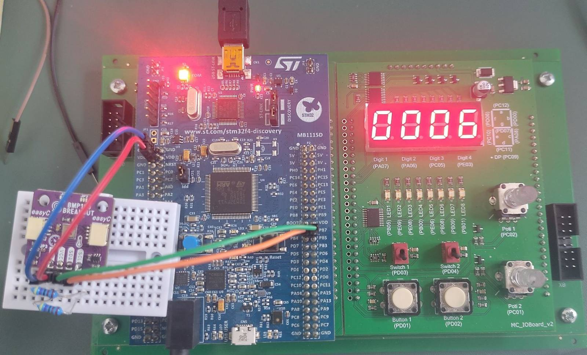

# Luftdruck Sensor Projekt: GY-BMP180 mit STM32F4 Discovery Board
Projekt für LVA `Angewandte Mikrocontrollerprogrammierung`, SS26 Jahrgang AE27

## Aufgabenstellung

Die Aufgabenstellung für Gruppe 3 - Sensor für Luftdruck `GY-BMP180`
**Messen Sie Änderungen des Luftdrucks und zeigen Sie diese an.**

| Nr | Aufgabe | Erledigt |
|----|-----------------------------------------------------------------------------------------------------------------------------------|:---:|
| 1  | Analyse der Funktionen der jeweiligen Komponente (Datenblatt aus Web besorgen!) | [ x ] |
| 2  | Anschluss der jeweiligen Komponente an den STM32 über die Schnittstelle, die der jeweilige Sensor bereithält. | [ x ] |
| 3  | Inbetriebnahme und (nachweisliche!) Lösung der gestellten Aufgabe. | [ x ] |
| 4  | Geeignete Visualisierung der Ergebnisse unter Zuhilfenahme des E/A-Boards (7-Segmentanzeige, LED, usw.) oder eines 2004-LCD-Displays. | [ x ] |
| 5  | Erstellung einer Test-SW auf dem STM32, wobei die Bedienung der jeweiligen Komponente in wiederverwendbare Funktionen ausgelagert sein muss. | [ x ] |
| 6  | Dokumentation von Anschluss, Funktion, Parametern, Randbedingungen usw. sowie der SW. | [ x ] |

## Sensordaten: BMP180
Der Sensor GY-BMP180 ist in der Lage, Temperatur, Luftdruck und Luftfeuchte
zu messen

Siehe Datenblatt: https://cdn-shop.adafruit.com/datasheets/BST-BMP180-DS000-09.pdf


## I2C Kommunikation
Die I2C Addresse des BMP180 ist `0xEE` laut dem Datenblatt

### Verkabelung
Mit zusätzlichen 4,7kOhm Pull-up Widerständen bei SDA und SCL wird wie folgt verkabelt:

```

BMP180              STM32F4-DISCOVERY
--------------------------------------
GND ---------------> GND
VCC ---------------> VDD

SDA ---+-----------> PB7
       |
    [ 4.7k ]
       |
       ------------> VDD

SCL ---+-----------> PB6
       |
    [ 4.7k ]
       |
       ------------> VDD
       
```


## Cube MX Konfiguration
Projekt generiert in CubeMX: 
1. Bei Connectivity sit I2C zu aktivieren

## Verwendete HAL Funktionen

1. **HAL_I2C_Mem_Read()** - Liest per I2C Daten aus dem Sensorregister.

    

2. **HAL_I2C_Mem_Write()** - Schreibt per I2C Daten in eine gewünschte Speicheradresse.

    

## Bibliotheksfunktionen

Folgende Funktionen wurden in `bmp180.h` erstellt:

Siehe auch die Doxygen-Gruppe @ref bmp180_driver für die öffentliche Bibliothek sowie die Quelldateien auf GitHub:

- [bmp180.h](https://github.com/blurbler2/Luftdruck-Sensor/blob/main/Core/Inc/bmp180.h)
- [bmp180.c](https://github.com/blurbler2/Luftdruck-Sensor/blob/main/Core/Src/bmp180.c)

- `BMP180_Start`
- `BMP180_GetTemp`
- `BMP180_GetPress`
- `BMP180_GetAlt`

Auf Seite 15 vom Datenblatt ist der Algorithmus für Druck und Temperatur Messung dargestellt, welcher dafür nachgebaut wurde:

    

## 1. Kallibrierungswerte einlesen aus dem EEPROM vom BMP180
Der Sensor hat einen intern beschriebenen Speicher, in dem er 11 individuelle Kallibrierungs-Koeffizienten mit jeweils 16 bit hinterlegt. Diese sind erforderlich, um die ausgelesenen Rohdaten in korrekte Temperatur- und Luftdruckwerte umzuwandeln.

Der BMP180 physikalische Änderungen mittels piezoelektrischem Effekt und liefert unkompensierte Rohwerte. Produktionsbedingt können diese leicht unterschiedliche Eigenschaften je Sensor haben.

Der Mikrokontroller muss daher bei jedem Start zunächst die im internen EEPROM gespeicherten 176 Bit (11 Kalibrierwerte, jeweils 16 Bit) auslesen, um die Formeln für Druck und Temperatur korrekt anwenden zu könen.

Die Werte heißen laut Datenblatt `AC1 bis AC6 und B1, B2, MB, MC, MD`, diese Werden als Kallibrierungsdaten einem Array `Callib_Data` initialisiert mit 0 und Start bei der BMP180 Speicher Adresse `0xAA` auf dem Mikrokontroller zwischengespeichert.

Mithilfe der HAL Funktion, um i2c memory zu lesen und zu schreiben werden die Kallibrierungswerte aus dem Sensorregister gelesen und in eine gewünschte Speicheradresse geschrieben.

### `HAL_I2C_Mem_Read(BMP180_I2C, BMP180_ADDRESS, Callib_Start, 1, Callib_Data,22, HAL_MAX_DELAY);`

Parameter:
- `BMP180_I2C`: das I2C-Interface, hi2c1
- `BMP180_ADDRESS`: Sensoradresse, hier 0XEE
- `Callib_Start`: Startregister 0xAA
- `1`: Registeradresse ist 1 Byte breit
- `Callib_Data`: Array als Zielpuffer für die gelesenen Daten
- `22`: Anzahl der zu lesenden Bytes
- `HAL_MAX_DELAY`: warten, bis der Vorgang fertig ist

Aus je 2 Byte im Array wird ein 16-Bit-Kallibrierungswert gebaut
`AC1 = ((Callib_Data[0] << 8) | Callib_Data[1]);`
Das High-Byte wird dabei um 8 Bit nach links verschoben und mit |  mit dem Low-Byte verknüpft. 
    -> Beide Bytes (Index 0 und Index 1) ergeben also einen 16 Bit Wert.
    -> AC1 ist dann ein kalibrierter Sensorparameter.

Nach diesem Prinzip werden **alle 11 Kalibrierungsparameter** erstellt:

- `AC1, AC2, AC3 (signed short)`: Temperatur-/Druck-Kalibrierungskoeffizienten, in linearen Termen der Druckkompensation auftreten
- `AC4 (unsigned short)`: Faktor in Divisionsschritten (dient zur Skalierung / Division) 
- `AC5, AC6 (unsigned short)`: weitere Kalibrierungskoeffizienten, werden bei Temperaturberechnung als Multiplikatoren/Offsets verwendet (z. B. AC5 dient zur Skalierung von UT)
- `B1, B2 (signed short)`: weitere Druck‑Korrekturkoeffizienten (nichtlinearer Teil)
- `MB, MC, MD (signed short)`: Temperaturkorrekturkonstanten, erscheinen in der Berechnung von X2 und B5

**Wichtig:**
Der BMP180  speichert einige Kalibrierwerte als vorzeichenbehaftet (unsigned short) andere nicht (short).

Physikalisch sind das keine direkten Messgrößen, sondern Parameter eines Herstellermodels, das die nichtlinearen Eigenschaften des individuellen Sensorelements korrigiert.

## 2. Temperatur: Von Rohdaten zu echten Messwerten 
\htmlonly
\image html getut-datasheet.png "unkompensierte Temperaturformel aus dem Datenblatt"
\endhtmlonly
\latexonly
\begin{center}
\includegraphics[width=0.5\textwidth]{getut-datasheet.png}
\end{center}
\endlatexonly

### Temperaturmessung — GetUTemp()
- schreibt Steuerbyte 0x2E ins Register 0xF4 -> startet Temperaturmessung
- wartet ~5ms (Messzeit)
- Liest 2 Bytes aus 0xF6 aus und liefert damit den ungefähren Rohwert UT (uint 16).

Um aus dem unkompensierten Temperaturwert wird mit der Funktion `BMP180_GetTemp()` der "echte" Messwert berechnet:

```text
X1 = (UT - AC6) * AC5 / 2^15
X2 = (MC * 2^11) / (X1 + MD)
B5 = X1 + X2
T  = (B5 + 8) / 2^4
```

Die Temperatur in °C ist `T / 10`.

Die Formeln kommen direkt aus dem BMP180‑Datenblatt. 

Die Funktion gibt dann die Temperatur in °C aus, °C=T/10 weil in 0.1°C Schritten gerechnet wird.

## 3. Luftdruck: Von Rohdaten zu echten Messwerten 
\htmlonly
\image html getup-datasheet.png "unkompensierte Luftdruckformel aus dem Datenblatt"
\endhtmlonly
\latexonly
\begin{center}
\includegraphics[width=0.5\textwidth]{getup-datasheet.png}
\end{center}
\endlatexonly

### Druckmessung — Get_UPress(oss)
- schreibt in 0xF4 das Kommando `0x34 + (oss << 6)` (oss = Oversampling setting 0..3) und die Wartezeit wird abgewartet
    Abhängig vom Wert `oss`, dem Over-Sampling-Setting, bei höherer Auflösung mit längeren Wartezeiten (5...26ms).
- liest 3 Bytes von 0xF6 (MSB, LSB, XLSB), kombiniert sie zu einem 24 Bit Wert und shiftet 
- Ergebnis: UP unkompensierter Luftdruck
    bei höheren OSS werden mehr Bits genutzt, der Bit-Shift normalisiert den Rohwert entsprechend

Um aus dem unkompensierten Luftdruckwert wird mit der Funktion `BMP180_GetPress()` der "echte" Messwert berechnet:

```text
X1 = (UT - AC6) * AC5 / 2^15
X2 = (MC * 2^11) / (X1 + MD)
B5 = X1 + X2
B6 = B5 - 4000

X1 = (B2 * B6^2 / 2^12) / 2^11
X2 = (AC2 * B6) / 2^11
X3 = X1 + X2

B3 = ((AC1 * 4 + X3) * 2^oss + 2) / 4

X1 = (AC3 * B6) / 2^13
X2 = (B1 * B6^2 / 2^12) / 2^16
X3 = (X1 + X2 + 2) / 4

B4 = AC4 * (X3 + 32768) / 2^15
B7 = (UP - B3) * 50000 / 2^oss

if B7 < 2^31:
    p = (B7 * 2) / B4
else:
    p = (B7 / B4) * 2

X1 = (p / 2^8)^2 * 3038 / 2^16
X2 = -7357 * p / 2^16
p  = p + (X1 + X2 + 3791) / 2^4
```

## [ Extra ] Seehöhe: Aus Luftdruck mit Referenzhöhe bestimmen

Um aus dem Luftdruck die aktuelle Seehöhe zu berechnen, wurde `BMP180_GetAlt` definiert:

**Seehöhe aus Druck berechnen:**
Internationale Höhenformel laut [Wikipedia](https://de.wikipedia.org/wiki/Barometrische_H%C3%B6henformel): 
```text
h = 44330 * (1 - (p / p0)^(1 / 5.255))
```

p … der gemessene Druck in Pascal (Pa)

p_0 … Referenz-(Meeresspiegel-)Druck in Pascal (Pa)

## 4. Visualisierung
Zur Visualisierung wurde die Sieben Segment Anzeige auf dem FH Übungsboard verwendet, mit der dafür zur Verfügung gestellten Bibliothek von Prof Paulis aus dem 3. Semester, WS25 Jahrgang AE27.

### Anzeige-Steuerung
Der Anzeigemodus wird in  `main.c` per Taster gesteuert:
    - `Button1` (PD1): wechselt zwischen Luftdruck `DISP_PRESSURE` und Luftdruckdifferenz`DISP_DELTA`
   - `Button2` (PD2): wechselt zyklisch zwischen `DISP_TEMPERATURE` → `DISP_ALTITUDE` → `DISP_PRESSURE` ...

### Anzeigeformate (je Modus)
   - `DISP_PRESSURE`: zeigt Druck skaliert als *Bar* mit drei Nachkommastellen (Beispiel: `0994` mit Dezimalpunkt links ergibt `0.994` → entspricht ~0.994 bar). Intern wird `Pressure/100` verwendet und der Dezimalpunkt so gesetzt, dass `0.xxx` erscheint.
   - `DISP_DELTA`: absolute Druckänderung in Pascal, ganzzahlig, keine Nachkommastellen.
   - `DISP_TEMPERATURE`: Temperatur in °C mit zwei Nachkommastellen (z.B. `08.30` für 8.30 °C). Negative Temperaturen werden auf der 7‑Seg nicht gezeigt (stattdessen `----`).
   - `DISP_ALTITUDE`: Höhe in Metern, ganzzahliger Wert (z.B. `0266` = 266 m).


## Funktionsweise

Kurzüberblick über Ablauf und Anzeigeverhalten der Firmware:

### Messung
Gemessen wird im normalen Betriebsmodus in der Hauptschleife von main.c kontinuierlich, etwa alle 500 ms. Das passiert durch den letzten HAL_Delay(500) in der Schleife.

### Kalibrierung und Ableitungen
Beim ersten Lauf wird aus einem bekannten Referenzhöhenwert (`KnownAltitudeMeters` in `main.c`) der statische Meeresspiegeldruck berechnet (`SeaLevelPressure`).

Aus dem gemessenen Druck werden die berechnete Höhe (`Altitude`) und die Differenz seit der letzten Messung (`PressureDelta`, in Pa) abgeleitet.

### Visualisierung
siehe oben
   
#### Abgrenzungen
Die 7‑Segmentanzeige ist auf Werte 0..9999 begrenzt; Werte außerhalb dieses Bereichs werden auf 9999 gekappt.
 
## Test-SW

Die wiederverwendbare Test-SW für den BMP180 liegt in `Core/Inc/test_bmp180.h` und `Core/Src/test_bmp180.c`.
Sie läuft auf dem STM32 selbst und prüft den Sensor direkt über I2C.

### Was wird getestet?
- I2C-Erreichbarkeit des BMP180 über `TestBMP180_CheckI2C()`.
- Initialisierung des Sensors über `TestBMP180_Init()`.
- Ein kompletter Messzyklus über `TestBMP180_RunOnce()`.
- Die Rückgabewerte für Temperatur, Luftdruck, Höhe und Druckdifferenz.

### Wo stehen die Tests?
- Test-API: `Core/Inc/test_bmp180.h`
- Implementierung: `Core/Src/test_bmp180.c`
- Teststart im Firmware-Code: `Core/Src/main.c`
- VS-Code-Task: `.vscode/tasks.json` mit `Test BMP180 (Debug)`

### Voraussetzungen
- STM32F4 Discovery Board ist angeschlossen.
- BMP180 ist per I2C korrekt verdrahtet.
- Das Projekt wird mit `BMP180_TEST` als Compile-Definition gebaut.
- Für den Flash-Task müssen `st-flash` und das ARM-Objcopy-Tool verfügbar sein.

### Ablauf auf dem STM32
1. Der Testtask baut und flasht die Test-Firmware.
2. `main.c` startet im `BMP180_TEST`-Pfad direkt nach der I2C-Initialisierung.
3. `TestBMP180_CheckI2C()` prüft das Chip-ID-Register `0xD0` gegen `0x55`.
4. Danach liest `TestBMP180_RunOnce()` die Messwerte ein und hält sie für den Debugger fest.

## Lösung der Aufgabenstellung

Zusammenfassend wird der Luftdruckunterschied im Programm folgendermaßen berechnet:

- **Messung**: `PressurePa = BMP180_GetPress(oss)` liest den aktuellen Luftdruck in Pascal (Pa).
- **Differenz**: `PressureDelta = PressurePa - PressurePrev` (Pa). `PressurePrev` wird nach jeder Messung aktualisiert.
- **Anzeige**: `PressureBarX1000 = (PressurePa + 50) / 100` skaliert Pa → bar*1000 für die 7‑Segment‑Anzeige (z.B. 994 → 0.994 bar).

**Hinweis**: Alle Rechnungen erfolgen in ganzen Einheiten (Integer) zur Laufzeit auf dem STM32 (keine Gleitkommazahlen), um FPU‑Abhängigkeiten zu vermeiden.

### Demonstration (Foto):



## Interpretation

Eine Luftdruckänderung ist im Alltag meist nur eine kleine, langsame Verschiebung des Messwerts in Pascal oder hPa. Sinkt der Luftdruck über längere Zeit, deutet das oft auf ein nahendes Tiefdruckgebiet und damit auf instabileres Wetter hin. Steigt der Luftdruck dagegen langsam, ist das häufig ein Zeichen für ein Hochdruckgebiet und damit für stabileres Wetter.

Im Projekt zeigt sich das als kleine Änderung von `PressurePa` und als Wert in `PressureDelta`. Die Anzeige macht diese Veränderung sichtbar, auch wenn sie auf den ersten Blick nur aus wenigen Einheiten besteht.


## Quellen

Nach kurzer Online-Recherche, sind wir bereits auf diesen Artikel gestoßen, der uns durch die Aufgabenstellung geführt hat: 
- https://controllerstech.com/interface-bmp180-with-stm32/ 

Weitere nützliche Seiten:
- https://de.wikipedia.org/wiki/Barometrische_H%C3%B6henformel
- https://de.wikipedia.org/wiki/Luftdruck